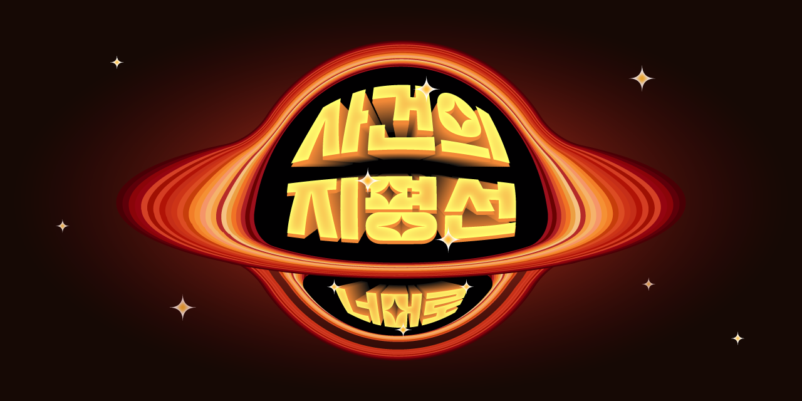

# 사건의 지평선

고윤하의 우주 명곡을 [event-horizon.kr](http://event-horizon.kr/)에서 만나보세요.



예를 들어 [event-horizon.kr/melon](https://event-horizon.kr/melon)는 멜론🍈으로 연결됩니다.

```bash
# Event Horizon | Youtube @YOUNHAOFFICIAL
/               https://youtu.be/BBdC1rl5sKY?t=8
/mv             https://youtu.be/BBdC1rl5sKY?t=8
/demo           https://youtu.be/ScBycwiM-Do
/ver0           https://youtu.be/ScBycwiM-Do
/ver.0          https://youtu.be/ScBycwiM-Do
/special        https://youtu.be/z1KLjaXHQVY?t=9
/special-clip   https://youtu.be/z1KLjaXHQVY?t=9

# Event Horizon | Music Streaming Service
/spotify        https://open.spotify.com/track/6RBziRcDeiho3iTPdtEeg9
/youtube-music  https://music.youtube.com/watch?v=j1uXcHwLhHM
/ytm            https://music.youtube.com/watch?v=j1uXcHwLhHM
/melon          http://kko.to/sisrv9OVPM
/genie          http://genie.co.kr/OM5OZ7
/flo            https://www.music-flo.com/detail/track/elnodzned/details
/vibe           https://vibe.naver.com/track/54692454
/bugs           https://music.bugs.co.kr/track/6155092
/apple          https://music.apple.com/kr/album/%EC%82%AC%EA%B1%B4%EC%9D%98-%EC%A7%80%ED%8F%89%EC%84%A0/1616649347?i=1616649362
/apple-music    https://music.apple.com/kr/album/%EC%82%AC%EA%B1%B4%EC%9D%98-%EC%A7%80%ED%8F%89%EC%84%A0/1616649347?i=1616649362
```

전체 목록은 [\_redirects](_redirects) 파일에서 확인할 수 있습니다.
